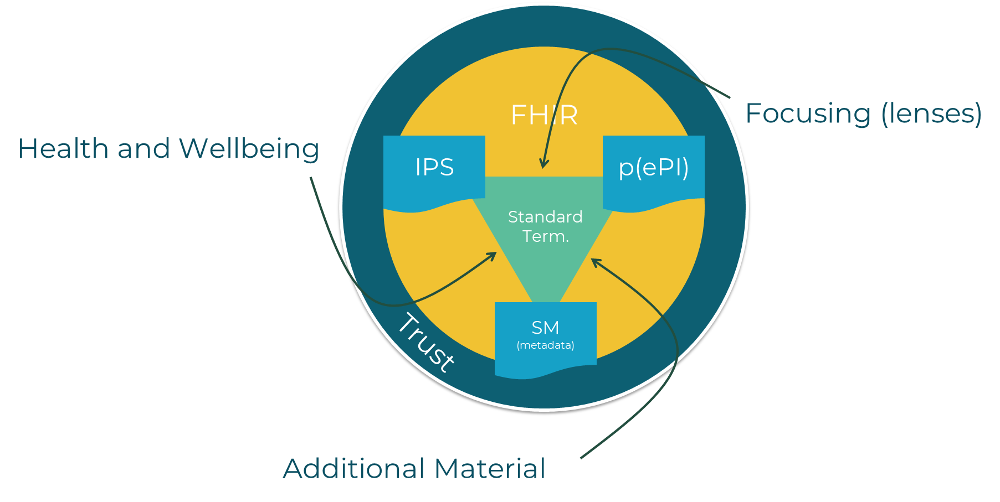

# Introducing FOSPS: Your Gateway to Innovative Digital Health Solutions

:::tip Welcome Developers!
This document introduces you to the **Federated Open-Source Platform and Services (FOSPS)**, a core component of the [Gravitate-Health project](https://www.gravitatehealth.eu/). FOSPS is designed to empower patients with digital tools for active personal health management and adherence to treatment by providing access to actionable, understandable, and reliable health information.
:::

If you're looking to integrate new components, develop specialized services, or build applications that leverage trustworthy health data, FOSPS provides a robust and flexible framework.

## What is FOSPS?

:::info Platform Overview
[FOSPS](/reference/fosps) is a **Federated Open-Source Platform and Services** that serves as the IT infrastructure and services for the Gravitate-Health project's G-lens system. It adopts a **microservice architecture**, which means it's built from independently deployable and loosely coupled components, ensuring agility, scalability, and autonomy.
:::



FOSPS is designed to be **open-source** and encourages **collaboration**. It provides a comprehensive set of tools, APIs, and resources for developers to create new components, integrate with existing ones, and build applications that enhance the user experience.

FOSPS is built on **HL7 FHIR standards**, ensuring high interoperability with a wide range of healthcare systems and data sources. This makes it easier for developers to exchange data and integrate their solutions within the healthcare ecosystem. One of the key elements required for the core functionalities of FOSPS is the use of **standard terminologies** (e.g., SNOMED-CT, ICPC-2) to semantically annotate ePIs, which is essential for enabling the focusing mechanism, Personal Health literature and material matchmaking.

In the FOSPS team we recognise the importance of **trust** in digital health solutions. Therefore, FOSPS includes a comprehensive **Cyber Trust Framework (CTF)** to ensure the integrity, authenticity, and traceability of all FHIR resources handled by the platform. This is critical for building trust in health information and ensuring that users can rely on the data they receive.

A key characteristic of FOSPS is its **federated** nature, allowing for deployment across multiple centers, often managed by different entities (like national/regional health services, medication agencies, or even pharmaceutical companies), while still enabling cooperation and interoperable connections between instances. Components of the FOSPS can also be deployed independently and integrated into other systems. 

### Features

By leveraging standards like FHIR and standard terminologies, FOSPS provides three core features,:

#### Focusing : Personalized Understanding Without Content Loss 

The most distinctive result of FOSPS is the [Focusing Mechanism](/reference/focusing), which provides patients with a personalized view of the [ePI](/reference/epi). Traditionally, patients struggle with long, highly technical paper leaflets where critical information is often buried. Focusing solves this by adapting the information to the context of the user—such as their age, existing conditions, or allergies—to ensure "effective and optimal understanding". 

The primary result for the patient is a digital leaflet that emphasizes what is most relevant to them through attention detail modification. For instance, if a patient is lactose intolerant, the platform can automatically highlight sections of the text discussing excipients that contain lactose. Conversely, information that is not applicable to the user’s demographic or condition can be collapsed, allowing the patient to skim or skip those sections while still retaining the ability to expand and read them if they choose. Crucially, because these leaflets are legal documents, FOSPS never removes or alters the underlying regulated text; it only modifies the visual presentation and enriches it with supplementary features like icons or hover-over glossaries to explain complex clinical terms. 

The intelligence behind this personalization is driven by [Lenses](/reference/lens), which are modular algorithms that encode specific medical, clinical, or cultural knowledge; determining which snippets of the leaflet should be highlighted, collapsed, or supplemented with extra content. To foster a diverse and evolving [ecosystem of lenses](/docs/tutorial-Lens/Examples), FOSPS treats each lens as a standalone digital asset packaged as a FHIR Library resource. This standardized packaging means that any qualified third party—including pharmaceutical companies, patient advocacy groups, or independent software developers—can create and contribute their own lenses to the platform. 

Technically, these lenses are applied through the [Lens Execution Environment (LEE)](/reference/lee), which acts like an optical stack where the output of one lens becomes the input for the next. Because the platform is federated and open-source, it does not rely on a single central authority. Instead, it allows for a decentralized "market" where different jurisdictions or healthcare providers can choose which certified lenses to apply, ensuring that the information a patient sees is not only personalized but also verified for safety and ethics (see [CTF](/reference/ctf) as to how this can be managed). Because the platform supports different [execution modes](/reference/lee#execution-modes) solutions on top of FOSPS may implement client-side focusing, where sensitive clinical data may remain on the patient’s personal device, ensuring that the process of focusing information doesn't require sharing private health records with external cloud servers unless the user explicitly consents. The platform also supports more traditional server-side focusing, where all the information is processed in the cloud server provided by the trusted health institution. 

#### Supporting Material: Beyond the Digital Leaflet 

FOSPS extends the patient’s education through the management of [Supporting Material (SM)](/reference/supporting-material), which encompasses both regulated additional Risk Minimization Measures (aRMM) and non-regulated Health Education Material (HEM). The result of this feature is that patients are no longer limited to the text of a leaflet; they receive a curated collection of multimedia content—such as instructional videos on how to use an inhaler or infographics about managing side effects—that are directly relevant to their prescribed treatment. 

This is achieved through an automated [matchmaking algorithm](/reference/sm-matchmaking). The algorithm analyses the metadata of available materials (like language, addressed conditions, and associated products) and compares it with the terms found in the patient’s clinical profile. For the patient, this means the platform serves as a personalized librarian, filtering out irrelevant noise and only presenting supplemental resources that match their specific "patient journey" and literacy level. 

#### Health and Wellbeing: Information Relative to the Patient Summary 

FOSPS provides a comprehensive interface for Health and Wellbeing that is entirely relative to the user’s clinical status. By accessing the IPS, the platform retrieves a snapshot of the patient’s allergies, medications, and active problems. When combined with the Persona Vector (PV)—a data element used to standardize personal preferences and lifestyle factors—the platform offers a holistic view of the patient’s health context not just related to their medication (thus complementing the previous features). 

The result is a highly secure, privacy-preserving environment where a patient can manage their health data and receive recommendations that are uniquely relative to them. This reinforces the core mission of FOSPS: providing a trustworthy, standards-based foundation that empowers citizens to become active and confident participants in their own healthcare. 

### Platform Architecture

FOSPS is a microservices-based backend infrastructure designed to support the G-lens solution, empowering users with trustworthy, personalized [Electronic Product Information (ePI)](/reference/epi). FOSPS operates as a FHIR-native platform, utilizing the HL7 Fast Healthcare Interoperability Resources(FHIR) standard and Standard Terminologies (such as SNOMED-CT, ICPC-2, and LOINC) as a common language to link patient data with medicinal and educational content. 
The platform is structured in [three layers](/reference/architectural-layers):

#### 1. App Layer

This includes front-end applications for end-users like patients and healthcare professionals (HCPs), as well as web interfaces for administrators and developers.

#### 2. Service Layer

This is where the core operations occur, housing processing and analysis components, AI services, and connectors to data sources.

#### 3. Data Layer

This layer contains the platform's data sources in a standardized form, including both sensitive (e.g., patient data) and non-sensitive (e.g., public health information) data.

:::note Federated Architecture
A key characteristic of FOSPS is its **federated** nature, allowing for deployment across multiple centers, often managed by different entities (like national health services), while still enabling cooperation and interoperable connections between instances.
:::

## Key Concepts for Developers

:::tip Essential Terminology
To effectively interact with FOSPS, it's helpful to understand some core concepts:
:::

* **[HL7 FHIR (Fast Healthcare Interoperability Resources)](https://www.hl7.org/fhir/)**: The interoperability standard upon which FOSPS is built. It defines rules and specifications for exchanging healthcare data electronically.

* **[Electronic Product Information](/reference/epi (ePI))**: A digitally structured, regulator-approved source of authoritative information about a medicinal product. The Federated Open-Source Publishing System (FOSPS) enhances the clarity, accessibility, and practical usefulness of ePIs for patients, caregivers, and healthcare professionals.

* **[International Patient Summary](/reference/ips (IPS))**: A standardized, cross-border extract of a patient’s essential health information, designed to support continuity of care. Because it contains sensitive personal health data, the IPS plays a central role in safely tailoring medication information to individual needs.

* **[Supporting Material (SM) / Risk Minimization Measures (RMM) / Health Education Material (HEM)](/reference/supporting-material)**: These terms refer to complementary digital content that supports ePIs or general health education. RMMs are regulated materials, while HEMs are less regulated but still come from trusted sources. FOSPS manages this content to provide relevant supplemental information.

* **[Focusing Mechanism](/reference/focusing)**: This is the process of adapting ePI information to the specific context of an end-user to achieve optimal understanding. It involves operations like highlighting, collapsing, or adding new content.

* **[Preprocessors](/reference/preprocessor)**: These are software services that semantically annotate raw ePIs, categorizing text units with medical terms or patient characteristics (like age or gender) using standard terminologies (e.g., SNOMED-CT, ICPC-2). This "[preprocessed ePI](/reference/p-epi)" (p(ePI)) is then ready for lenses.

* **[Lenses](/reference/lens)**: These are pieces of code that encode specific knowledge (e.g., medical facts, cultural aspects, patient preferences) and logic. Lenses determine how ePI content should be adapted during the focusing process (e.g., which sections to highlight or collapse).

* **[Cyber Trust Framework (CTF)](/reference/ctf)**: A set of tools and services designed to establish and assess the trustworthiness of digital content. It uses techniques like digital signatures, hashing, and provenance tracking to ensure content integrity, origin, and certifications.

* **[Provenance](/reference/provenance)**: A FHIR standard record that describes the agents (actors), entities (resources), and activities (processes) involved in producing, delivering, or influencing a resource. It creates a comprehensive supply chain record for content, enabling traceability.

* **[Audit Log](/reference/audit-log)**: A component that provides granular auditability for all platform activity, maintaining an immutable and non-repudiable trace of events using blockchain technology.

* **[G-lens](/reference/g-lens)**: This is the overarching solution and trademarked name for the Gravitate-Health system. It creates a focused, personalized view of electronic product information (ePI) for citizens.

## How FOSPS Helps You Develop

:::info Development Framework
FOSPS offers a comprehensive framework and resources for developers to integrate new components and extend its functionalities:
:::

### Open Source and Collaboration

* FOSPS is an **open-source platform**, and much of its development is transparently managed on GitHub, providing access to source code, documentation, and sprints.
* The platform is designed to foster collaboration and allows for the integration of **3rd party developments**.

### Standardized and Interoperable Foundation

* FOSPS is built upon **HL7 FHIR standards**, ensuring high interoperability with a wide array of existing and future healthcare systems. This simplifies data exchange and integration.
* The use of **standard terminologies** (e.g., SNOMED-CT, ICPC-2) ensures consistency and enables core functions like focusing and material matchmaking.

### Extensible Architecture

* The **microservice architecture** allows for modularity and flexibility. You can choose which components to run, develop your own, and integrate them into the platform.
* FOSPS provides a small set of **optional front-end applications (Web User Interfaces)** targeted towards secondary stakeholders like platform administrators, HCPs, and developers.

## Specific Development Avenues

### Lenses Development

:::info Lens Capabilities
Lenses are HL7 FHIR objects encoding JavaScript code, packaged using the [Lens Profile](https://build.fhir.org/ig/hl7-eu/gravitate-health/StructureDefinition-lens.html).
:::

**Key Points:**

* JavaScript code must comply with a "function interface" so it can be invoked from the [Lens Execution Environment (LEE)](/reference/lee).
* Lenses cannot remove or directly alter ePI content due to legal regulations, only change its display format.
* Lenses can operate on both server-side and client-side focusing modes.
* Lenses should be packaged as a FHIR Lens profile (an extension of the standard Library type).
* The [FHIR Lens bundler](/docs/tutorial-Lens/Lens%20Bundler%20Tool%20Tutorial) tool can be used to aid in the packaging.

### Preprocessor Development

:::tip Semantic Annotation
Preprocessors are pluggable services that semantically annotate ePIs.
:::

**Requirements:**

* To be discovered by FOSPS, your Kubernetes deployment needs to include the label:

  ```yaml
  eu.gravitate-health.fosps.preprocessing=true
  ```

* They must [implement an endpoint](https://github.com/Gravitate-Health/preprocessing-service-example/blob/main/openapi.yaml) with the path `/preprocess` that receives an ePI and returns its preprocessed version, updating its category from "Raw" to "Preprocessed".

### Connector Development

:::info Data Integration
[Connectors](/reference/connectors) are modules responsible for retrieving and transforming information from diverse sources into standard FHIR resources.
:::

**Capabilities:**

* Connectors generate **provenance statements** for actions like resource access, supporting the CTF.
* They can implement a cache server to optimize queries to external resources.
* To be auto-discovered by FOSPS, Kubernetes cron jobs for connectors need to include the label:

  ```yaml
  eu.gravitate-health.fosps.connector=true
  ```

### Specialized Extended Services Development

:::tip Custom Services
You can develop new microservices from scratch in any language or tool, provided they include a Dockerfile for containerization.
:::

**Requirements:**

* These services can connect to existing FOSPS services using their APIs.
* For external access, an Istio `VirtualService` must be included.
* The use of the [Audit Log](/reference/audit-log) for maintaining validated logs is highly encouraged for new services.

### Patient Application Development (Frontend)

:::info Frontend Integration
Frontend applications can interact with FOSPS APIs for authentication/authorization, FHIR server access, and focusing mechanisms.
:::

**Authentication:**

* FOSPS uses **[Keycloak](/reference/keycloak)** as the Identity Provider for authentication and authorization, supporting standard protocols like OAuth 2.0 and OpenID Connect for Single-Sign-On solutions.

---

## Trust and Monitoring Infrastructure

:::note Security & Monitoring
**Key Infrastructure Components:**

* **[Cyber Trust Framework (CTF)](/reference/ctf)** components (Integrity Module, Provenance Engine, Trust Functions) ensure the integrity, authenticity, and traceability of all content handled by the platform. This is critical for building trust in health information.

* **[Audit Log](/reference/audit-log)** provides immutable, blockchain-backed logging for all platform activities, enhancing security and auditability.

* **[Metrics Manager](/reference/metrics)** (using Grafana/Prometheus) offers comprehensive monitoring capabilities for system health, performance, and usage, with customizable dashboards for administrators.
:::

---

:::tip Start Building
By leveraging these features and following the provided guidelines, developers can build powerful, trustworthy, and user-centric digital health solutions on top of the FOSPS platform.
:::
