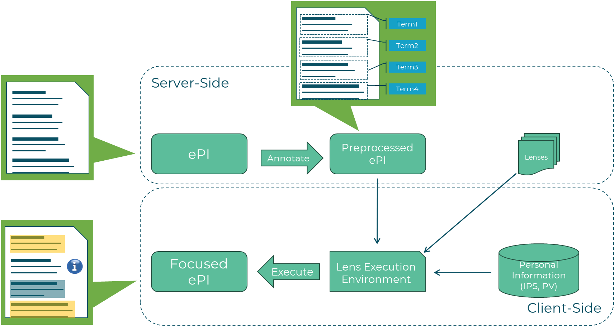

# Focusing

**Focusing** is the process defined as "Adapting information to the context of the end user for effective and optimal understanding of the information" without modifying the regulated content itself.

## Core Principle

The fundamental constraint of Focusing is that **regulated [ePI](./epi.md) content cannot be removed or altered**. Focusing only changes:
- Visual representation (highlighting, collapsing)
- Supplementary content (adding hyperlinks, icons, videos)
- Organization and presentation

## The Focusing Workflow

1. **Input**: Raw [ePI](./epi.md) provided from [Connectors](./connectors.md)
2. **Preprocessing**: [Preprocessors](./preprocessor.md) execute sequentially to create [p(ePI)](./p-epi.md) by adding [semantic annotations](/docs/tutorial-Preprocessor/Basic%20Annotation) using standard terminologies (e.g., SNOMED-CT).
3. **Lens Selection**: [Focusing Manager](./focusing-manager.md) selects/discovers [Lenses](./lens.md) in [server-side focusing](#execution-modes)
4. **Execution**: [LEE](./lee.md) runs lens logic with [IPS](./ips.md)/[PV](./persona-vector.md)
5. **Output**: [Focused ePI (f(ePI))](./f-epi.md) personalized for patient

## Personalization Inputs

Focusing uses three critical inputs:
- **[p(ePI)](./p-epi.md)**: Semantically annotated ePI
- **[IPS](./ips.md)**: Patient clinical data
- **(Optional) [PV](./persona-vector.md)**: User context and preferences

## Adaptation Techniques

### Attention Detail Modification
- **Highlight**: Mark highly relevant sections (CSS class `"highlight"`)
- **Collapse**: Minimize irrelevant sections (CSS class `"collapse"`)
- **Standard**: Leave default presentation

See [Attention Detail Modification](./attention-modification.md) for details.

### Supplementary Content
- Add hyperlinks to [Supporting Material](./supporting-material.md)
- Embed images, videos, pictograms
- Create interactive elements (glossary, hover boxes)

## Execution modes
There are two main modes of executing the focusing process:
- **Server-side focusing**: [Focusing Manager](./focusing-manager.md) orchestrates the entire process and returns [f(ePI)](./f-epi.md) to client, meaning the server has access to IPS/PV data and can execute complex lenses with full context.
- **Client-side focusing**: Client retrieves [p(ePI)](./p-epi.md), lenses and executes lenses locally (e.g., embedding the [LEE](./lee.md) in a mobile app) for enhanced privacy and responsiveness.

Because the Focusing Manager is designed to be flexible, it supports explicit data input which defines a special case of client-side focusing where the client provides all necessary data (ePI, IPS, PV) in the request, allowing the server to execute lenses without needing to retrieve additional data from the FHIR Server. This mode is referred as **hybrid-side focusing**.

## Result Characteristics

The [f(ePI)](./f-epi.md) is:
- **Ephemeral**: Not cached (always regenerated), in the same way as the IPS is ephemeral
- **Personalized**: Specific to one patient context
- **Regulatory-compliant**: Original content preserved
- **Enhanced**: With visual and supplementary adaptations

## Related Concepts

- [Focusing Manager](./focusing-manager.md) - Orchestration component
- [Preprocessor](./preprocessor.md) - Semantic annotation
- [Lens](./lens.md) - Adaptation logic
- [LEE](./lee.md) - Execution environment
- [p(ePI)](./p-epi.md) - Preprocessed input
- [f(ePI)](./f-epi.md) - Focused output
- [G-lens](./g-lens.md) - Overall solution
